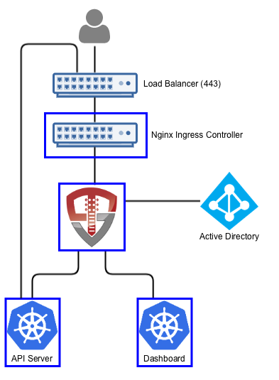
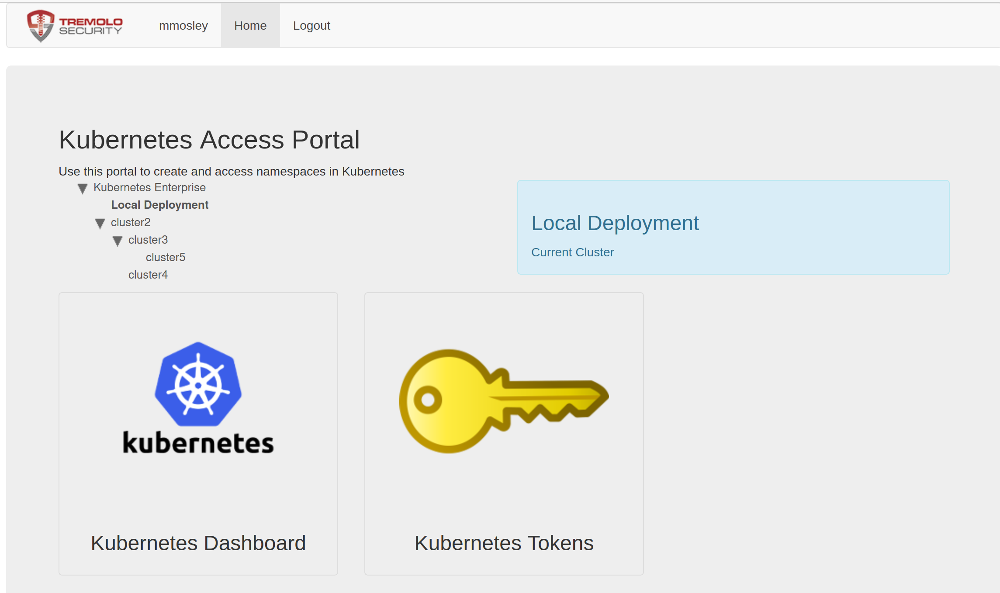

# Orchestra Login Portal for ActiveDirectory

[](https://vimeo.com/297400302)

*Short video of logging into Kubernetes and using kubectl using Active Directory*

Orchestra Login Portal provides a login portal for Kubernetes that allows you to authenticate with your Active Directory credentials, use Active Directory groups for RBAC authorizations and provides integration for both `kubectl` and the Kubernetes Dashboard (https://github.com/kubernetes/dashboard).  The portal runs inside of Kubernetes, leveraging Kubernetes for scalability, secret management and deployment. 



When a user accesses Kubernetes using Orchestra, they'll access both the login portal and the dashboard through OpenUnison (instead of directly via an ingress).  OpenUnison will inject the user's identity into each request, allowing the dashboard to act on their behalf.  The login portal has no external dependencies outside of Active Directory and Kubernetes.  All objects for session state are stored as CRDs.

# Deployment

## Watch a Video

This 11 minute video shows the entire deployment and user onboarding process

[](https://vimeo.com/297399119)

## What You Need To Start

Prior to deploying Orchestra you will need:

1. Kubernetes 1.10 or higher
2. The Nginx Ingress Controller deployed (https://kubernetes.github.io/ingress-nginx/deploy/)
3. The certificate authority certificate for your Active Directory forest
4. Deploy the dashboard to your cluster 
5. helm 3.0+

The deployment is a four step process:

1. Add Tremolo Security's Helm repo to your own
2. Deploy the OpenUnison Operator
3. Create a secret for your Active Directory password
4. Deploy OpenUnison

## Add Tremolo Security's Helm Repo

```
helm repo add tremolo https://nexus.tremolo.io/repository/helm/
helm repo update
```

## Deploy The OpenUnison Operator

Create your namespace
```
kubectl create ns openunison
```

Deploy the operator
```
helm install openunison tremolo/openunison-operator --namespace openunison
```

Wait for the operator pod to be available
```
watch kubectl get pods -n openunison
```

## Create A Secret For Your Active Directory Password

Create a secret in the `openunison` namespace:

```
apiVersion: v1
type: Opaque
metadata:
  name: orchestra-secrets-source
  namespace: openunison
data:
  AD_BIND_PASSWORD: aW0gYSBzZWNyZXQ=
  K8S_DB_SECRET: aW0gYSBzZWNyZXQ=
  unisonKeystorePassword: aW0gYSBzZWNyZXQ=
kind: Secret
```

| Property | Description |
| -------- | ----------- |
| AD_BIND_PASSWORD | The password for the ldap service account used to communicate with Active Directory/LDAP |
| unisonKeystorePassword | The password for OpenUnison's keystore, should NOT contain an ampersand (`&`) |
| K8S_DB_SECRET | A random string of characters used to secure the SSO process with the dashboard.  This should be long and random, with no ampersands (`&`) |

## Deploy OpenUnison

Copy `values.yaml` (https://raw.githubusercontent.com/OpenUnison/helm-charts/master/openunison-k8s-login-activedirectory/values.yaml) and update as appropriate:

| Property | Description |
| -------- | ----------- |
| network.openunison_host | The host name for OpenUnison.  This is what user's will put into their browser to login to Kubernetes |
| network.dashboard_host | The host name for the dashboard.  This is what users will put into the browser to access to the dashboard. **NOTE:** `network.openunison_host` and `network.dashboard_host` Both `network.openunison_host` and `network.dashboard_host` **MUST** point to OpenUnison |
| network.api_server_host | The host name to use for the api server reverse proxy.  This is what `kubectl` will interact with to access your cluster. **NOTE:** `network.openunison_host` and `network.dashboard_host` |
| network.k8s_url | The URL for the Kubernetes API server | 
| network.session_inactivity_timeout_seconds | The number of seconds of inactivity before the session is terminated, also the length of the refresh token's session |
| active_directory.base | The search base for Active Directory |
| active_directory.host | The host name for a domain controller or VIP.  If using SRV records to determine hosts, this should be the fully qualified domain name of the domain |
| active_directory.port | The port to communicate with Active Directory |
| active_directory.bind_dn | The full distinguished name (DN) of a read-only service account for working with Active Directory |
| active_directory.con_type | `ldaps` for secure, `ldap` for plain text |
| active_directory.srv_dns | If `true`, OpenUnison will lookup domain controllers by the domain's SRV DNS record |
| cert_template.ou | The `OU` attribute for the forward facing certificate |
| cert_template.o | The `O` attribute for the forward facing certificate |
| cert_template.l | The `L` attribute for the forward facing certificate |
| cert_template.st | The `ST` attribute for the forward facing certificate |
| cert_template.c | The `C` attribute for the forward facing certificate |
| certs.use_k8s_cm  | Tells the deployment system if you should use k8s' built in certificate manager.  If your distribution doesn't support this (such as Canonical and Rancher), set this to false |
| myvd_config_path | The path to the MyVD configuration file, unless being customized, use `WEB-INF/myvd.conf` |
| dashboard.namespace | The namespace for the dashboard.  For the 1.x dashboard this is `kube-system`, for the 2.x dashboard this is `kubernetes-dashboard` |
| dashboard.cert_name | The name of the secret in the dashboard's namespace that stores the certificate for the dashboard |
| dashboard.label | The label of the dashboard pod, this is used to delete the pod once new certificates are generated |
| dashboard.service_name | The name of the service object for the dashboard |
| k8s_cluster_name | The name of the cluster to use in the `./kube-config`.  Defaults to `kubernetes` |
| image | The name of the image to use |
| enable_impersonation | If `true`, OpenUnison will run in impersonation mode.  Instead of OpenUnison being integrated with Kubernetes via OIDC, OpenUnison will be a reverse proxy and impersonate users.  This is useful with cloud deployments where oidc is not an option |
| monitoring.prometheus_service_account | The prometheus service account to authorize access to the /monitoring endpoint |

Additionally, add a base 64 encoded PEM certificate to your values under `trusted_certs` for `pem_b64`.  This will allow OpenUnison to talk to Active Directory using TLS.

Finally, run the helm chart:

`helm install orchestra tremolo/openunison-k8s-login-activedirectory --namespace openunison -f /path/to/values.yaml`


## Complete SSO Integration with Kubernetes

If using impersonation, you can skip this section.  Run `kubectl describe configmap api-server-config -n openunison` to get the SSO integration artifacts.  The output will give you both the API server flags that need to be configured on your API servers.  The certificate that needs to be trusted is in the `ou-tls-certificate` secret in the `openunison` namespace.

## First Login

To login, open your browser and go to the host you specified for `network.openunison_host` in your `values.yaml`.  For instance if `network.openunison_host` is `k8sou.tremolo.lan` then navigate to https://k8sou.tremolo.lan.  You'll be prompted for your Active Directory username and password.  Once authenticated you'll be able login to the portal and generate your `.kube/config` from the Tokens screen.

## CLI Login

You can bypass manually launching a browser with the `oulogin` kubectl plugin - https://github.com/TremoloSecurity/kubectl-login.  This plugin will launch a browser for you, authenticate you then configure your kubectl configuration without any pre-configuration on your clients. 


## Authorizing Access via RBAC

On first login, if you haven't authorized access to any Kubernetes roles you won't be able to do anything.  There are two approaches you can take:

### Group Driven Membership

If you can populate groups in Active Directory for Kubernetes, you can use those groups for authorization via OpenUnison.  OpenUnison will provide all of a user's groups via the `id_token` supplied to Kubernetes.  The `groups` claim is a list of values, in this case the Distinguished Names of the user's groups.  As an example, I created a group in AD called `k8s_login_ckuster_admins` in the `Users` container of my `ent2k12.domain.com` domain.  This means the group will be `CN=k8s_login_ckuster_admins,CN=Users,DC=ent2k12,DC=domain,DC=com` (you can get the exact name of the group from the `distinguishedName` attribute of the group in Active Directory).  To authorize members of this group to be cluster administrators, we create a `ClusterRoleBinding`:

```
kind: ClusterRoleBinding
apiVersion: rbac.authorization.k8s.io/v1
metadata:
  name: activedirectory-cluster-admins
subjects:
- kind: Group
  name: CN=k8s_login_ckuster_admins,CN=Users,DC=ent2k12,DC=domain,DC=com
roleRef:
  kind: ClusterRole
  name: cluster-admin
  apiGroup: rbac.authorization.k8s.io
```

### User Driven Membership

If you are not able to create groups in Active Directory, you can directly add users to role bindings.  Kubernetes requires that you identify openid connect users with the prefix of the url of the identity provider.  So if your `OU_HOST` is `k8sou.tremolo.lan` and your user's login is `mmosley` your username to Kubernetes would be `https://k8sou.tremolo.lan/auth/idp/k8sIdp#mmosley`.  To create a cluster role binding to give cluster-admin access to a specific user:

```
kind: ClusterRoleBinding
apiVersion: rbac.authorization.k8s.io/v1
metadata:
  name: activedirectory-cluster-admins
subjects:
- kind: User
  name: https://k8sou.tremolo.lan/auth/idp/k8sIdp#mmosley
roleRef:
  kind: ClusterRole
  name: cluster-admin
  apiGroup: rbac.authorization.k8s.io
```

*NOTE*: There are multiple reasons this is a bad idea:
1.  Hard to audit - There is no easy way to say "what role bindings is `mmosley` a member of?
2.  Difficult to remove access - Same reason as #1, you need to figure out every role binding a user is a member of to remove
3.  Easy to get wrong - If you mistype a user's login id Kubernetes won't tell you

If you can't use Active Directory groups, take a look at the OpenUnison Identity Manager for Kubernetes - https://github.com/TremoloSecurity/openunison-qs-kubernetes/tree/activedirectory.  This tool adds on to the login capabilities with the ability to manage access to the cluster and namespaces, along with providing a self service way for users to request new namespaces and manage access.

# Adding Applications and Clusters for Authentication

OpenUnison can support more applications for SSO then just Kubernetes and the dashboard.  You can add other clusters and applications that support OpenID Connect by adding some custom resources to your `openunison` namespace.

## Add a Trust

The `Trust` tells your OpenID Connect enabled application it can trust authentication requests from your OpenUnison.  To start you'll need:

1. **Callback URL** - This URL is where OpenUnison redirects the user after authenticating.
2. **Client Secret** - Web applications, like GitLab, will need a secret that is shared between the two systems.  Applications with CLI components, like ArgoCD, don't need a client secret.
3. **Client ID** - This is how you identify your application to OpenUnison.

OpenUnison will provide the following claims for your application to consume:

| Claim | Description |
| ----- | ----------- |
| sub   | Unique identifier as supplied from authentication |
| name  | Combination of first name and last name |
| preferred_username | A username supplied from authentication |
| email | The user's email address |
| groups | The list of groups provided by the authentication source |

Once you have everything you need to get started, create the `Trust` object.  

### Create a Secret

If you're application is using a client secret, a `Secret` needs to be created to hold it.  This can either be a new `Secret` or it can be a new one.  Which ever `Secret` you add it to, keep a note of the name of the `Secret` and the key in the `data` section used to store it.

If your application doesn't have a client secret, skip this step.

### Create the `Trust`

Create a `Trust` object in the `openunison` namespace.  Here's one for GitLab you can use as an example:

```
apiVersion: openunison.tremolo.io/v1
kind: Trust
metadata:
  name: gitlab
  namespace: openunison
spec:
  accessTokenSkewMillis: 120000
  accessTokenTimeToLive: 60000
  authChainName: LoginService
  clientId: gitlab
  clientSecret:
    keyName: gitlab
    secretName: orchestra-secrets-source
  codeLastMileKeyName: lastmile-oidc
  codeTokenSkewMilis: 60000
  publicEndpoint: false
  redirectURI:
  - https://gitlab.local.tremolo.dev/users/auth/openid_connect/callback
  signedUserInfo: false
  verifyRedirect: true
```

Here are the details for each option:

| Option | Desription |
| ------ | ---------- |
| accessTokenSkewMillis | Milliseconds milliseconds added to account for clock skew |
| accessTokenTimeToLive | Time an access token should live in milliseconds |
| authChainName | The authentication chain to use for login, do not change |
| clientId | The client id shared by your application | 
| clientSecret.scretName | If using a client secret, the name of the `Secret` storing the client secret |
| clientSecret.keyName | The key in the `data` section of the `Secret` storing the client secret |
| codeLastMileKeyName | The name of the key used to encrypt the code token, do not change |
| codeTokenSkewMilis | Milliseconds to add to code token lifetime to account for clock skew |
| publicEndpoint | If `true`, a client secret is required.  If `false`, no client secret is needed |
| redirectURI | List of URLs that are authorized for callback.  If a URL is provided by your application that isn't in this list SSO will fail |
| signedUserInfo | if `true`, the userinfo endpoint will return a signed JSON Web Token.  If `false` it will return plain JSON |
| verifyRedirect | If `true`, the redirect URL provided by the client **MUST** be listed in the `redirectURI` section.  Should **ALLWAYS** be `true` if not in a development environment |

Once the `Trust` is added to the namespace, OpenUnison will pick it up automatically.  You can test by trying to login to your application.

## Add a "Badge" to Your Portal

When you login to the Orchestra portal, there are badges for your tokens and for the dashboard.  You can dynamically add a badge for your application too.  Here's an example `PortalUrl` object for ArgoCD:

```
apiVersion: openunison.tremolo.io/v1
kind: PortalUrl
metadata:
  name: argocs
  namespace: openunison
spec:
  label: ArgoCD
  org: B158BD40-0C1B-11E3-8FFD-0800200C9A66
  url: https://ArgoCD.apps.192-168-2-140.nip.io
  icon: iVBORw0KGgoAAAANSUhEUgAAANIAAADwCAYAAAB1/Tp/AAAfQ3pUWHRSYXcgcHJvZ...
  azRules:
  - constraint: o=Tremolo
    scope: dn
```

| Option | Descriptoin |
| ------ | ----------- |
| label  | The label shown on badge in the portal |
| org    | If using orgnaizations to organize badges, the uuid of the org.  If not using organizations, leave as is |
| url    | The URL the badge should send the user to |
| icon   | A base64 encoded icon with a width of 210 pixels and a height of 240 pixels |
| azRules | Who is authorized to see this badge?  See https://portal.apps.tremolo.io/docs/tremolosecurity-docs/1.0.19/openunison/openunison-manual.html#_applications_applications for an explination of the authorization rules |

Once created, the badge will appear in the Orchestra portal!  No need to restart the containers.

## Organizing Badges

If you're adding multiple badges or clusters, you may find that the number of badges on your front page become difficult to manage.  In that case you can enable orgnaizations in OpenUnison and organize your badges using an orgnaization tree.

### Enable Organizations on your Portal Page

Edit the `orchestra` object in the `openunison` namespace (`kubectl edit openunison orchestra -n openunison`).  Look for the `non_secret_data` section and add the following:

```
- name: SHOW_PORTAL_ORGS
  value: "true"
```

Once you save, OpenUnison will restart and when you login there will now be a tree that describes your organizations.  



### Creating Organizations

Add an `Org` object to the `openunison` namespace.  Here's an example `Org`:

```
apiVersion: openunison.tremolo.io/v1
kind: Org
metadata:
  name: cluster2
  namespace: openunison
spec:
  description: "My second cluster"
  uuid: 04901973-5f4c-46d9-9e22-55e88e168776
  parent: B158BD40-0C1B-11E3-8FFD-0800200C9A66
  showInPortal: true
  showInRequestAccess: false
  showInReports: false
  azRules:
  - scope: dn
    constraint: o=Tremolo
```

| Option | Description |
| ------ | ----------- |
| description | What appears in the blue box describing the organization |
| uuid | A unique ID, recommend using Type 4 UUIDs |
| parent | The unique id of the parent.  `B158BD40-0C1B-11E3-8FFD-0800200C9A66` is the root organization |
| showInPortal | Should be `true` |
| showInRequestAccess | N/A |
| showInReports | N/A |
| azRules | Who is authorized to see this badge?  See https://portal.apps.tremolo.io/docs/tremolosecurity-docs/1.0.19/openunison/openunison-manual.html#_applications_applications for an explination of the authorization rules |

Once added, the new organizations will be loaded dynamiclly by OpenUnison.  Change the `org` in your `PortalUrl` object to match the `uuid` of the `Org` you want it to appear in.


# Using Your Own Certificates

If you want to integrate your own certificates see our wiki entry - https://github.com/TremoloSecurity/OpenUnison/wiki/troubleshooting#how-do-i-change-openunisons-certificates

# Monitoring OpenUnison

This deployment comes with a `/metrics` endpoint for monitoring.  For details on how to integrate it into a Prometheus stack - https://github.com/TremoloSecurity/OpenUnison/wiki/troubleshooting#how-do-i-monitor-openunison-with-prometheus.

# Trouble Shooting Help

Please take a look at https://github.com/TremoloSecurity/OpenUnison/wiki/troubleshooting if you're running into issues.  If there isn't an entry there that takes care of your issue, please open an issue on this repo.

# Whats next?

Now you can begin mapping OpenUnison's capabilities to your business and compliance needs.  For instance you can add multi-factor authentication with TOTP or U2F, Create privileged workflows for onboarding, scheduled workflows that will deprovision users, etc.

# Customizing Directory Connections

If you're running multiple directories, or need to connect to a generic LDAP directory isntead of Active Directory you can provide a custom MyVirtualDirectory configuration file without a re-build of your containers.  Start with the myvd.conf file at https://github.com/OpenUnison/openunison-k8s-login-activedirectory/blob/master/src/main/webapp/WEB-INF/myvd.conf.  ONLY edit the section that begins with `server.activedirectory`.  As an example, the below configuration works against a generic LDAPv3 directory with the `VirtualMemberOf` insert configured to create a `memeberOf` attribute on users so we can supply groups to Kubernetes:

```
#Global AuthMechConfig
server.globalChain=accesslog

server.globalChain.accesslog.className=com.tremolosecurity.proxy.myvd.log.AccessLog

server.nameSpaces=rootdse,myvdroot,shadowUsers,activedirectory
server.rootdse.chain=dse
server.rootdse.nameSpace=
server.rootdse.weight=0
server.rootdse.dse.className=net.sourceforge.myvd.inserts.RootDSE
server.rootdse.dse.config.namingContexts=o=Tremolo
server.myvdroot.chain=root
server.myvdroot.nameSpace=o=Tremolo
server.myvdroot.weight=0
server.myvdroot.root.className=net.sourceforge.myvd.inserts.RootObject

server.shadowUsers.chain=debug,mapping,api
server.shadowUsers.nameSpace=ou=shadow,o=Tremolo
server.shadowUsers.weight=0
server.shadowUsers.enabled=true
server.shadowUsers.debug.className=net.sourceforge.myvd.inserts.DumpTransaction
server.shadowUsers.debug.config.logLevel=info
server.shadowUsers.debug.config.label=k8s
server.shadowUsers.mapping.className=net.sourceforge.myvd.inserts.mapping.AttributeMapper
server.shadowUsers.mapping.config.mapping=mail=email,givenName=first_name,sn=last_name
server.shadowUsers.api.className=com.tremolosecurity.myvd.K8sCrdInsert
server.shadowUsers.api.config.nameSpace=openunison
server.shadowUsers.api.config.k8sTargetName=k8s

server.activedirectory.chain=objectguid2text,dnmapper,memberof,objmap,membertrans,ldap
server.activedirectory.nameSpace=ou=activedirectory,o=Data
server.activedirectory.weight=0
server.activedirectory.enabled=true
server.activedirectory.objectguid2text.className=com.tremolosecurity.proxy.myvd.inserts.util.UUIDtoText
server.activedirectory.objectguid2text.config.attributeName=objectGUID
server.activedirectory.dnmapper.className=net.sourceforge.myvd.inserts.mapping.DNAttributeMapper
server.activedirectory.dnmapper.config.dnAttribs=member,owner,member,distinguishedName,manager
server.activedirectory.dnmapper.config.localBase=ou=activedirectory,o=Data
server.activedirectory.dnmapper.config.urlAttribs=
server.activedirectory.dnmapper.config.remoteBase=#[AD_BASE_DN]
server.activedirectory.memberof.className=net.sourceforge.myvd.inserts.mapping.VirtualMemberOf
server.activedirectory.memberof.config.searchBase=ou=activedirectory,o=Data
server.activedirectory.memberof.config.applyToObjectClass=inetOrgPerson
server.activedirectory.memberof.config.attributeName=memberOf
server.activedirectory.memberof.config.searchObjectClass=groupOfNames
server.activedirectory.memberof.config.searchAttribute=member
server.activedirectory.memberof.config.replace=false
server.activedirectory.objmap.className=net.sourceforge.myvd.inserts.mapping.AttributeValueMapper
server.activedirectory.objmap.config.mapping=objectClass.inetOrgPerson=inetOrgPerson,objectClass.groupofnames=groupOfNames
server.activedirectory.membertrans.className=net.sourceforge.myvd.inserts.mapping.AttributeMapper
server.activedirectory.membertrans.config.mapping=member=member,uid=uid
server.activedirectory.ldap.className=com.tremolosecurity.proxy.myvd.inserts.ad.ADLdapInsert
server.activedirectory.ldap.config.host=#[AD_HOST]
server.activedirectory.ldap.config.port=#[AD_PORT]
server.activedirectory.ldap.config.remoteBase=#[AD_BASE_DN]
server.activedirectory.ldap.config.proxyDN=#[AD_BIND_DN]
server.activedirectory.ldap.config.proxyPass=#[AD_BIND_PASSWORD]
server.activedirectory.ldap.config.useSrvDNS=#[SRV_DNS]
server.activedirectory.ldap.config.ignoreRefs=true
server.activedirectory.ldap.config.passBindOnly=true
server.activedirectory.ldap.config.maxIdle=90000
server.activedirectory.ldap.config.maxMillis=90000
server.activedirectory.ldap.config.maxStaleTimeMillis=90000
server.activedirectory.ldap.config.minimumConnections=10
server.activedirectory.ldap.config.maximumConnections=10
server.activedirectory.ldap.config.usePaging=false
server.activedirectory.ldap.config.pageSize=0
server.activedirectory.ldap.config.heartbeatIntervalMillis=60000
server.activedirectory.ldap.config.type=#[AD_CON_TYPE]
server.activedirectory.ldap.config.sslSocketFactory=com.tremolosecurity.proxy.ssl.TremoloSSLSocketFactory
```

Once OpenUnison is deployed, create a directory with your `myvd.conf` file in it and deploy it as a `ConfigMap`:

```
kubectl create configmap myvd --from-file . -n openunison
```

Next edit the `openunison` deployment to mount the `ConfigMap` to `/etc/myvd` and change the environment variable `MYVD_CONFIG_PATH` to `/etc/myvd/myvd.conf`.  Once the OpenUnison pods have been recreated, you can login with your LDAP uid (as opposed to an Active Directory samAccountName).

# Updating Secrets and Certificates

To update any of the secrets in the source secret:

1. Update the `orchestra-secrets-source` secret in the `openunison` namespace as appropriate
2. Add an annotation (or edit an existing one) on the `orchestra` `openunison` object in the `openunison` namespace

This will trigger the operator to update your OpenUnison pods.  To update certificates or non-secret data, just update it in the `orchestra` `openunison` object.

# Customizing Orchestra

To customize Orchestra - https://github.com/TremoloSecurity/OpenUnison/wiki/troubleshooting#customizing-orchestra

# Example Implementations
Amazon EKS - https://www.tremolosecurity.com/post/multi-tenant-amazon-eks-the-easy-way-part-i-authentication
